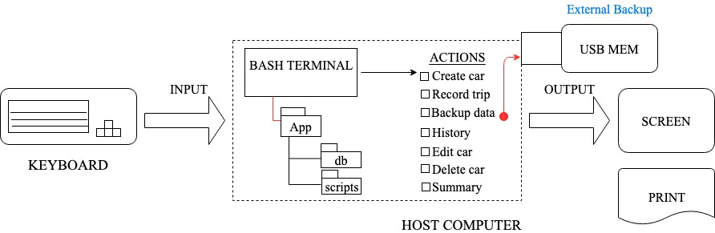
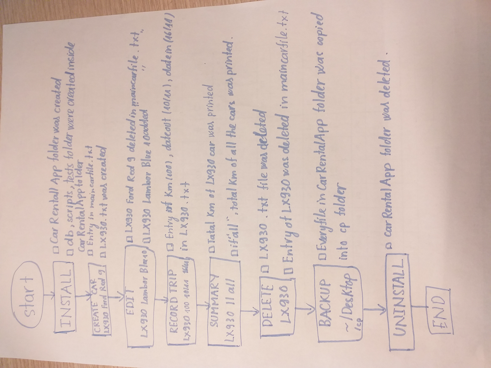
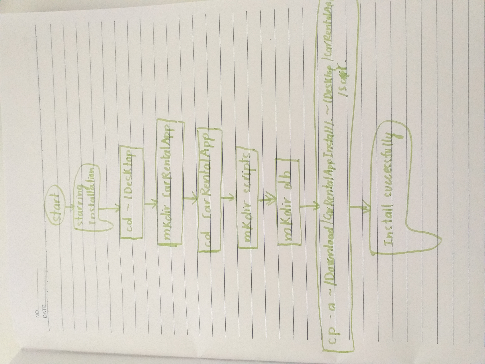
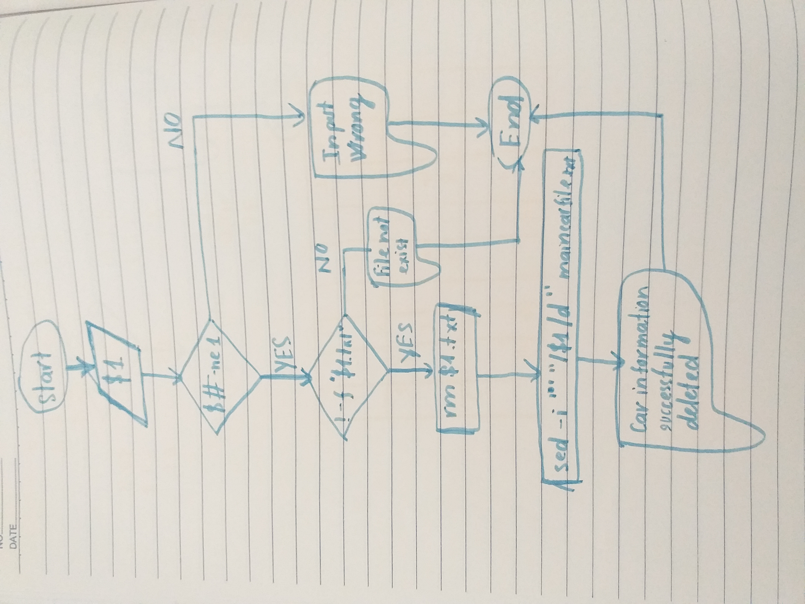
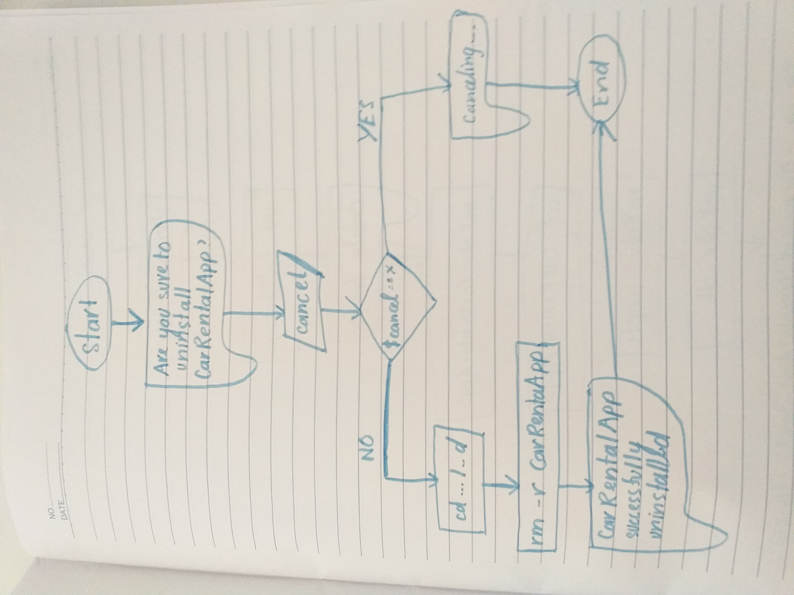

Car Rental Minimal App
===========================

A car rental management minimal app in Bash.

Contents
-----
  1. [Planning](#planning)
  1. [Design](#design)
  1. [Development](#development)
  1. [Evalution](#evaluation)

Planning
----------
### Defining the Problem (Topic 1.1.1)
 A car rental office wants to purchase a program that collect basic information about the distance driven for each car. This program should have easy commands to create information about car: Name, model of cars and number of passengers. Furthermore, the user can recored the trip of each car, the day start, end and the kilometer that the car runned.  Also, they can edit the record (add or remove) the information of the car they want. Last but not least, the user can storage the system and backup it in their computer or USB. 
 
### Solution proposed
 I decided that choosing Bash Script would be the best solution for Car Rental App because the user required a simple installation and could use the program easily. Next, I choose terminal to write the program, because it has already been on computer so we no need to install it. So the user can use terminal to install and use the program easily and conveniently. This program help the user do the task with two or less steps.
 
### Success Criteria
 These are measurable outcomes
 1. A car can be created and stored in the database
 2. A car information can be edited
 3. A car can be deleted from the database
 4. The installation is ***simple -> one step process***
 5. A summery (total/average distance traveled)can be generated for a particular car
 6. Trips can be recorded and stored for an existing car.
 7. A basic detabase system is implemented.
 8. A basic backup functionallity is available.
 
Design
---------

**Fig. 1** First sketch of the system showing the main input/output components, actions and software requirement.

### Testing procedure

**Fig. 2** This diagram shows the input and the expected output when running programs.

### Flowchart

**Fig. 3** This is the flow chart of installing CarRentalApp process.

**Fig. 4** This is the flow chart of editing car information process.

**Fig. 5** This is the flow chart of uninstalling CarRentalApp process.

Development
--------
### 1. Script to install the app
The following script creates the app folder and inside it creates two more folder: database and scripts

    #! /bin/bash
    #This file creates the structure for the 
    #minimal car Rental_App

    echo "Starring the installation"
    cd ~/Desktop
    #Create App folder
    echo "Creating folders"
    mkdir CarRentalApp
    cd CarRentalApp
    mkdir db
    mkdir scripts
    mkdir tests

    echo "Set up scripts file"
    cp -a ~/Downloads/CarRentalAppInstall/scripts/. ~/Desktop/CarRentalApp/scripts
    cd scripts
    bash frame.sh "Install successfully"

## 2. Create a new car
The following steps summarize the algorithm to create a new car in the system. 

① Get input from the arguments

② Check number of argurments; if 4 then continue, if not ext 'message'

    if [[ ($# -ne 4) ]]; then
    	echo "Incorrect input. Please enter Plate, Model, Color, Passengers. Exiting the program... "
    	exit
    fi

③ Write to main file with one extra line not erasing other Entries.

    echo "$plate $model $color $pp" >> ~/Desktop/CarRentalApp/db/maincarfile.txt

④ Create car tip file with license plate.txt
     
     echo "" > ~/Desktop/CarRentalApp/db/$plate.txt	
   
## 3. Summary 

  ① Input the name of the car (file=$1)
  
  ② Check if the number of argument =1 
  
    if [ $# -ne 1 ]; then
      echo "Enter license plate"
      ls
      exit
    fi
  
  ③ Calculate the total sum of km of each car
  
    total=0
    while read line;
    do
  	for km in $line
  	do
    	(( total=$km+$total ))
        break
  	done
    done < "$file.txt"
  
  ④ Show the total Km of each car
  
    cd ..
    cd scripts
    bash frame.sh "TOTAL DISTANCE TRAVELED FOR $file was: $total"

 ⑤ Calculate the total sum of all cars (if user enter "all" as argument)
  	
    if [ $file == all ]; then
    #Calculating total distance
    total=0
    #comand read used with while loop will read the fil
    # chosen of the end of loop done < "file.txt" line by line
    #this will loop throug all the txt files in folder
    for f in *.txt;
    do
    #This if sentance will avoid maincarfile.txt
        if  [[ ($f == "maincarfile.txt") ]];then
	    continue
	fi
    while read line;
       do
	  #for loop will go throug line word by word 
	  for km in $line
	  do
	    (( total=$km+$total ))
	    #break will break the loop after first cycle
	    break
	  done
	done < "$f"
    done
  
 　⑥ Show the total km of all the cars
       
    cd ..
    cd scripts
    bash frame.sh "TOTAL DISTANCE TRAVELED BY ALL CARS WAS: $total"
    exit	
 
 ## 4. Backup

   ① Input the location that user wants to backup (location=$1)

   ② Check if the user entered just one argument and copy file from source location to backup location

    if [[ $# -ne 1 ]]; then
       echo "Sorry, there was an error with backing up your files.
       exit
    else
       #we copy database	
       cp -a ~/Desktop/RentalCarApp/db $location
       echo "Successfully backed up into $location."
    fi

## 5.Delete car

① Input the name of the car want to delete (plate=$1)

②　Check if the argument provided is correct or not
  
    if [[ ($# -ne 1) ]];then
	echo "Input is wrong, please type Plate again"
  
③ Check if the car file license is exist or not
  
    if [ ! -f "$1.txt" ];then
	echo "The file don't exis. Please try again"

 ④ Delete the $plate.txt 
  
    rm $1.txt
	bash frame.sh "The file was successfully deleted"
	#delete whole line which includes the plate
	sed -i '' "/$1/d" maincarfile.txt
	bash frame.sh "The car information was successfully deleted"

## 6. Record trip

①　Input the info about the trip in the arguments (plate=$1 km=$2 dateout=$3 datein=$4)
②  Moving to instalation folder
	
    cd ~/Desktop/RentalCarApp/db/
	
③  Checking if the arguments input is correct andfile $plate.txt exist
  
    if [[ ($# -ne 4) ]]; then
  	echo "Incorrect input. Please enter Plate, kilometers, dateout, datein Exiting the program... "
    elif [ ! -f "$1.txt" ]; then
        echo "Car don't exist, please crate a car, exiting the program... "

④  Creating $plate.txt file with data about each specific car

    echo "$km $dateout $datein" >> $plate.txt
    echo "Trip recorded, exiting the program"

## 7. Edit car

① Enter License model color passenger in the argument (license=$1 model=$2 color=$3 passenger=$4)
② Check if the number of arguments is correct

    if [ $# -ne 4 ]; then
       echo "Error with the number of arguments"
       echo "Enter License Model Color Passengers"
       cd ..
       cd db
       ls
       exit
    fi
	
③ Checking if wanted car exists
     
      cd ../db
      if [ ! -f "$license.txt" ]; then
    	 echo "File not found!"
  	 cd ..
  	 cd db
  	 ls
      fi
      
④ Find the line with the given car plate and delete it

	sed -i ' ' "/^$license/d" maincarfile.txt
	
⑤ Add the new information
	
	echo "$license $model $color $passenger" >> maincarfile.txt
	
## 8. Uninstall

① Checking if user didn't click run uninstall program by accident
	
    echo "Are you sure you want to uninstall RentalCarApp?"
    echo "( Press enter to continue press x to cancel )"
    if [[ ($cancel == x) ]];then
  	echo "canceling..."
  	sleep 2
 	exit

② Remove everything in the CarRentalApp folder

    cd ../
    cd ../
    rm -r RentalCarApp
    echo "RentalCarApp succesfully uninstalled"
 
## TESTS
A. Install.sh
   - 1st Running : Wrong syntax
	   Using -f when finding directory -> using -d
	   
	      [[ -d "/Users/m19-018/Desktop/ComSciIsak/carRentalApp" && -d "/Users/m19-018/Desktop/ComSciIsak/carRentalApp/db"               && -d "/Users/m19-018/Desktop/ComSciIsak/carRentalApp/scripts" ]]
   - 2nd running: The program runned successfully
              
	      cd ../
	      cd ../
	      bash install.sh

  	      if [[ -d "/Users/m19-018/Desktop/ComSciIsak/carRentalApp" && -d "/Users/m19     					      -018/Desktop/ComSciIsak/carRentalApp/db" && -d "/Users/m19-018/Desktop/ComSciIsak/carRentalApp/scripts" ]];then
	   	   echo "Test the install program: passed"	
               else
	       echo "Test failed"
	       fi
 B. Delete.sh
 
    - 1st running: The program works successfully
                
    #!/bin/bash
    #This program will check if the car was deleted or not

    carDelete=$1
 
    cd ../
    cd scripts
    bash deleteCar.sh $1

    if [[ grep -q "$carDelete" "maincarfile.txt" && -f "/Users/m19-018/Desktop/ComSciIsak/carRentalApp/db/car/$carDelete.txt" ]]; then
        echo "Test failed"
        else
        echo "Test : passed"
    fi
C. Create.sh
   - 1st running: The program has one issuse: The license file not found. Due to I did not create file in correct location (db). The file was created in scripts folder
   - 2nd running: The syntax finding line including string input in text file was incorrect.
   - 3rd running: The program works successfully
        
	#!/bin/bash
        #This file test the first succes criterion, namely,
        #A car can be created and stored in the database

	#Step1: create a car using the script create
	bash ../db/create.sh TXM301 nissan red 9

	#Step2: Check that the license file.txt was created
	if [ -f ../db/car/"TXM301.txt" ]; then
		echo "test one:a txt file was cretead inside the db folder: passed"
	else
		echo "Test 1: Error. File not found"
	fi

	#Step3: Check that the car was added to the main file
	lastline=$( tail -n 1 ../db/maincarfile.txt )
	if [ "TXM301 nissan red 9" == "$lastline" ]; then
		echo "Test two: Record was entered correctly: Passed"
	else
		echo "Test two: Failed"
	fi
 D. Edit.sh
 
   - 1st running: The program has one error on wrong syntax of finding string in line and detele that line in text file
	   The reason is missing ' ' in sed -i ' ' "/^$license/d" maincarfile.txt
	  
   - 2nd running: The program works successfully
	      
Evaluation
-----------

|    CRITERIA                                                             |   MET?  |              Evidence                  |
| ----------------------------------------------------------------------- | ------- | -------------------------------------- |
| A simple based terminal program					  |   Yes   | - The program runned in bash terminal  |
|									  |	    |					     |
| A simple and transparent installation					  |   Yes   | - 1 step to install the program	     |
|									  |         |					     |
| Easy commands that allow to create a car, record trip, query the trip,  |   Yes   | - The user just need to run the program|   history of car, edit, and delete car	                                            and enter the input		    
|									  |         | 					     |
| Easy commands that allow to enter the detail of the trip distance (km)  |   Yes   | - The user just need to run the program|
|									  |         |and enter the trip detail               |
| A basic permanent storage system and backup				  |   Yes   | - Enter the location and the db folder |
|									  |         |will be backed up into that location
| A command to see total statistic					  |   Yes   | - The user just need to run summary    |
|									  |         |program and enter name of car or all
| User-skill independent						  |   Yes   | - Every program is easy to use with two|
|									  |         |or less step                            | 	 	

**IMPROVEMENT**
---------------

This program can be extended by:

①　Creating a program that calculate the money for renting a car

   - A program that manage the total money for each car and all the cars is really necessary for the user. Adding this feature will help the user more effectively manage the renting cars.
    
②  -  Having more language options. With the global intergration nowsaday, the diversity of language is significant thing to make a program widely used.

③  - Merge every program into one program to make the program more easily and conviniently used. The user just needs to open
one program and choose task instead of opening many programs.
